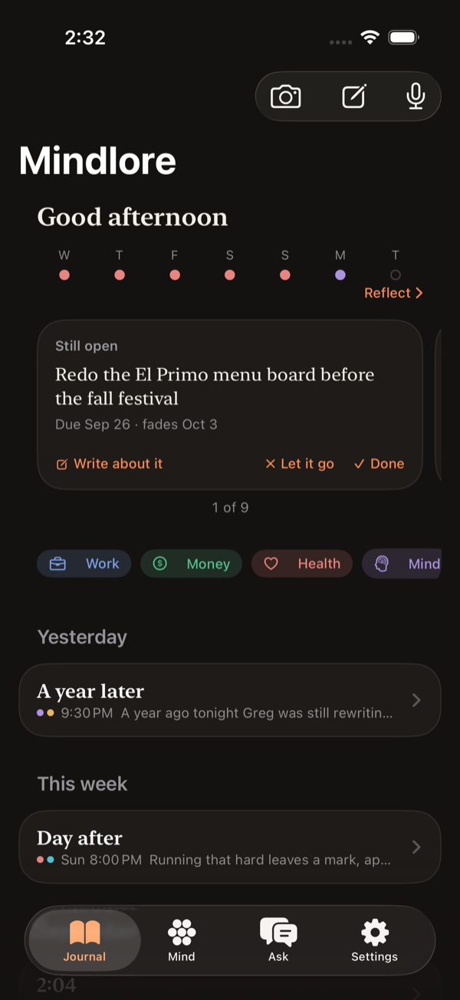
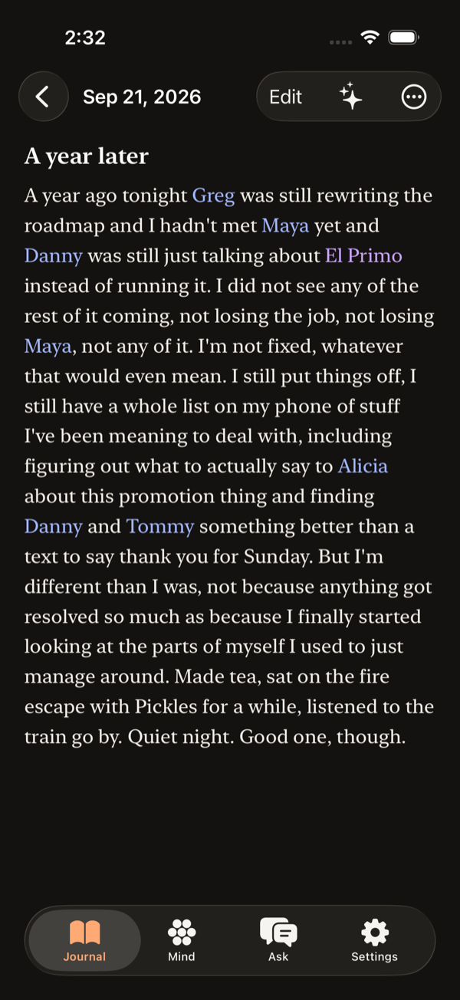
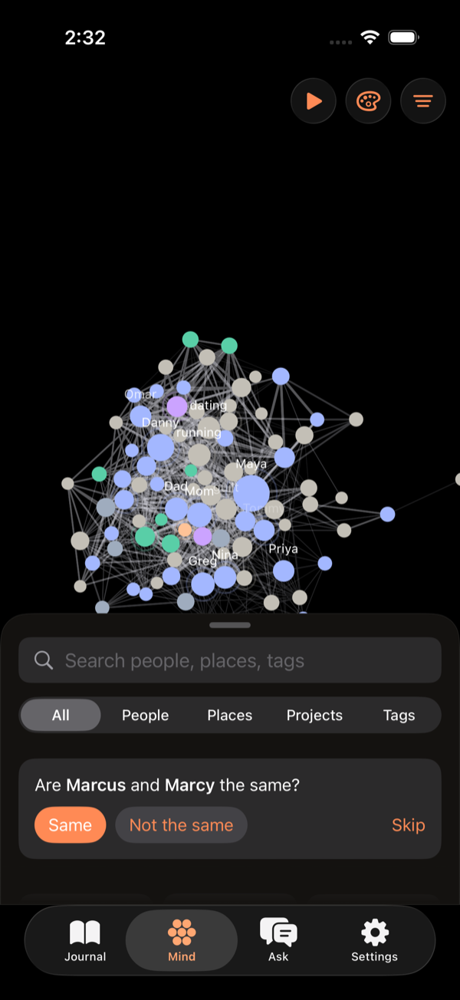
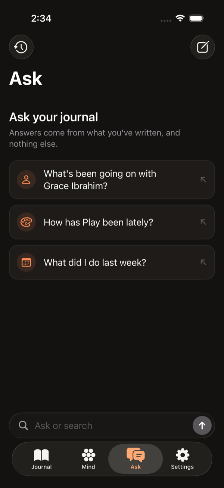

<p align="center">
  
</p>

<h1 align="center">Mindlore</h1>

<p align="center">
  A voice-first journal for iPhone that maps the people, places, and threads of your life.
</p>

<p align="center">
  <a href="https://github.com/natefikru/Mindlore/actions/workflows/ci.yml"></a>
  
  
</p>

<p align="center">
  
  
  
  
</p>

A journal for iPhone that you mostly talk to. Record an entry, write one, or photograph a page from a
paper notebook, and Mindlore turns it into text, gives it a title, and keeps track of who and what
you keep coming back to: the people, places, and projects in your life, the threads you left open,
and how the weeks have felt.

Everything lives on the phone. AI is optional and runs either on Apple's on-device model or on an
OpenAI key you bring yourself. Nothing leaves the phone unless you turn that on.

## What it does

- **Capture.** Voice entries are recorded as PCM so a crash or a force-quit mid-sentence loses
  nothing, then transcribed on device (or by OpenAI, if you chose it). Typed entries save within a
  second of the last keystroke. Photographed pages are transcribed page by page and wait for your
  approval before anything else reads them.
- **Mind.** A living map of everyone and everything your entries mention, drawn as a force-directed
  graph. Names that appear together are linked, recent links pull harder, and you can replay a year
  of the map in ten seconds. Merge duplicates, rename, hide, or tell it two people aren't the same.
- **Ask.** Questions answered from your journal, with every answer citing the entries it came from.
  Retrieval is BM25 over the entries plus what the graph knows, with date parsing ("last spring",
  "since April") and conversation carry-over, and the answer streams in as it is written.
- **Today and Reflect.** A daily row of cards (this day last year, a name you haven't mentioned in a
  while, an open thread that needs attention) and a week or month looked back on: mood, life areas,
  and one written paragraph.
- **Loose ends.** "Need to call the landlord" becomes a thread that is closed when a later entry
  says it happened, or fades on its own after six weeks of silence.

## Requirements

- Xcode 26.6 or later, iOS 26.5 deployment target.
- An iPhone for anything involving the microphone or on-device speech. The simulator can't run
  those models.
- Optional: an OpenAI API key, entered in the app's Settings.

## Building and testing

Open `Mindlore.xcodeproj` and run the `Mindlore` scheme, or from a terminal:

```bash
# Build and run the unit tests (about a minute of test time)
scripts/ci/test.sh unit

# Run specific UI test classes
scripts/ci/test.sh ui GraphUITests AskUITests
```

Both build first if nothing has been built yet. Unit tests use Swift Testing, UI tests use XCTest.
Set `TEST_RUNNER_MINDLORE_OPENAI_KEY` to run the AI tests against real OpenAI; without it the live
tests skip and the UI tests use a built-in stub.

For the raw `xcodebuild` commands and the reasons behind their flags, see
[CLAUDE.md](CLAUDE.md#commands).

## CI

GitHub Actions builds once and tests from that build. Unit tests run on every pull request and
every push to `main`. The UI suite (52 tests, each one launching the app) is split across five
runners and runs on pushes to `main`, on pull requests labeled `ui`, and on demand. A TestFlight
release workflow is written and switched off until the project moves to a paid developer team.
Details in [tasks/ci-plan.md](tasks/ci-plan.md).

## Testing on a phone

What the simulator can't show (recording, locking the screen mid-entry, force-quits, on-device
transcription) is checked on a real iPhone with the scripts in `scripts/device/`, which install a
debug build, stream the app's diagnostics, and pull its logs afterwards. Diagnostics carry IDs,
counts, and durations, never entry text. The steps are in [tasks/smoke-test.md](tasks/smoke-test.md).

Launch with `-seedStoryJournal` to see the app with a year of believable entries in their own store.

## Where things are

| Path | What's there |
| --- | --- |
| `Mindlore/Models` | `Entry`, `Entity`, `LooseEnd` and the rest of the SwiftData schema, kept CloudKit-safe |
| `Mindlore/Audio`, `Mindlore/Transcription` | Recording, ingest, and the on-device and cloud transcribers |
| `Mindlore/AI` | Providers, insights, titles, Ask |
| `Mindlore/Graph` | Entity resolution, merging, co-occurrence, the force simulation |
| `Mindlore/Views` | SwiftUI, one folder per tab |
| `docs/` | The build plan, what's left, privacy coverage, the demo story |
| `tasks/` | The plan in progress, lessons learned, and finished plans in `archive/` |

[CLAUDE.md](CLAUDE.md) is the architecture reference, and it goes deep: why each piece works the
way it does and what was measured before deciding.

## Status

Heading for a TestFlight beta. iCloud sync is designed and waiting on a paid Apple Developer
account; the data model already follows CloudKit's rules so it can be switched on without a
migration. What's left is tracked in [docs/remaining-work.md](docs/remaining-work.md).
